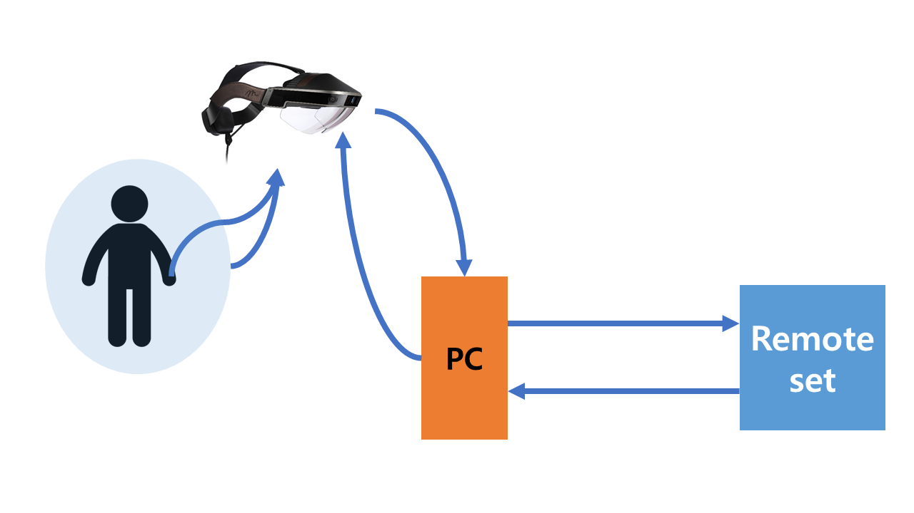

# Trans-Space 2.0
Sharing code of Trans-Space 2.0

## Settings  

### Figure

### Devices
HMD: Meta 2, Vive   
Camera:  
Other Tracker:  

## Body module
Input:  
Output:  
Function:  
Desired computing power:  

## Hand module
Input:  VGA RGB image / VGA depth image
Output:  26 hand pose parameters
Function:  
Desired computing power:  

## Hand & Object module
Input:  
Output:  
Function:  
Desired computing power:  

## Inner Data collection module
Input:  
Output:  
Function:  
Desired computing power:  

## Remote network module
Input:  
Output:  
Function:  
Desired computing power:  
